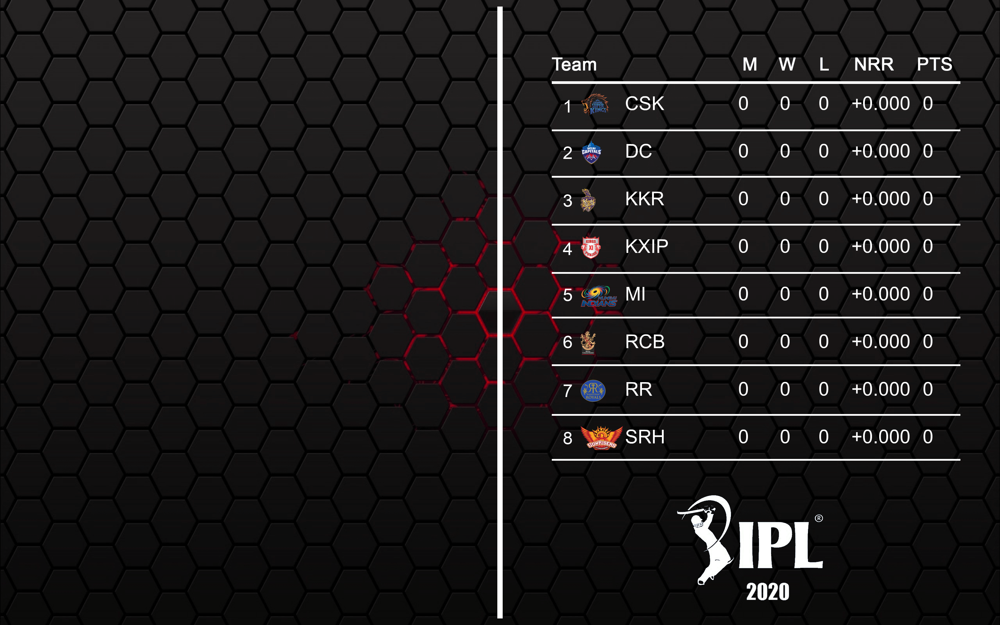

This app sets the Wallpaper of the system from fetching data from 'https://www.iplt20.com/points-table/2020'.

### Steps to setup 
* Clone the repo and run `npm i` to install all the dependencies

### Steps to run
* After every match run `npm start` to update your desktop background.

#### Note 
#### 1. You need to have node version 8 or above installed in your system.
#### 2. If you don't have internet connection then the table will show 0 for all values.

Here is a sample Desktop background that is generated

