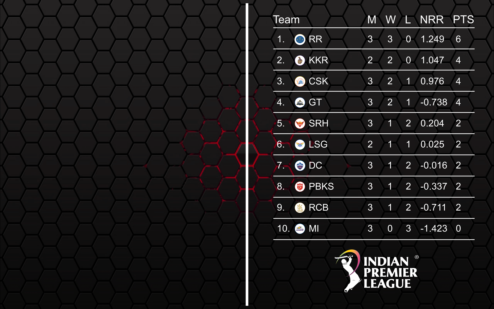

This app sets the Wallpaper of the system from fetching data from 'https://www.iplt20.com/points-table/2020'.

### Steps to setup 
* Install npm package: `npm i ipl-wallpaper -g`

### Steps to run
* After every match run `ipl-wallpaper` to update your desktop background.

#### Note 
#### 1. If you don't have internet connection then the table will show 0 for all values.

Here is a sample Desktop background that is generated

